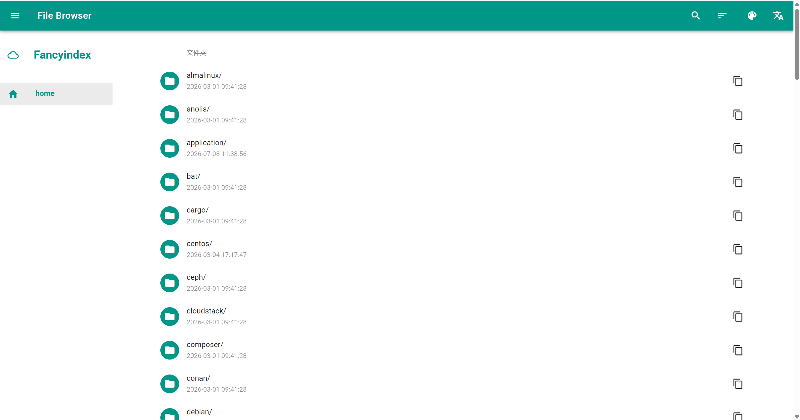
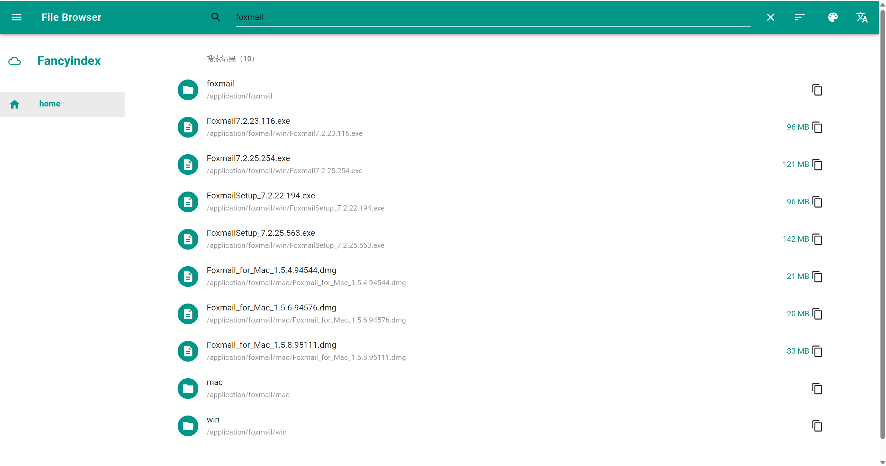
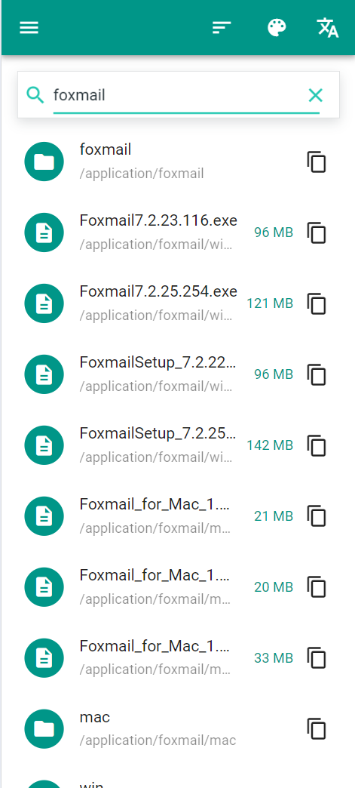

# Nginx Fancyindex Search Theme

Nginx Fancyindex Search Theme 是一套用于 `ngx-fancyindex` 目录列表的响应式前端主题。它保留 Nginx 对静态文件和目录的直接服务能力，使用 MDUI 呈现面包屑、目录/文件列表、主题切换、文件链接复制和 Markdown README 预览。

项目额外提供可选的递归搜索服务：它在 SQLite FTS5 中预建文件名与相对路径索引，用户搜索时不递归请求目录，也不在 Nginx 工作进程中扫描磁盘。搜索范围会自动限制为当前网页目录及其所有子目录、子文件。

## 目录

- [一、项目介绍](#一项目介绍)
- [二、生产环境快速部署](#二生产环境快速部署)
- [三、配置说明](#三配置说明)
- [四、搜索服务与运维](#四搜索服务与运维)
- [五、安全与性能边界](#五安全与性能边界)
- [六、故障排查](#六故障排查)
- [七、搜索 API](#七搜索-api)
- [八、开发与验证](#八开发与验证)
- [九、许可证](#九许可证)
- [十、联系方式](#十联系方式)

## 效果

|             主题首页              |
| :-------------------------------: |
|  |

|            搜索内容（PC端）            |
| :------------------------------------: |
|  |

|             搜索内容（移动端）             |
| :----------------------------------------: |
|  |

# 一、项目介绍

## 1.1 功能范围

| 能力 | 说明 |
| :-: | :-: |
| 目录主题 | 将 `ngx-fancyindex` 的原始目录表格转换为适配桌面与移动端的列表页面。 |
| 目录导航 | 根据当前 URL 自动生成面包屑和侧边路径导航。 |
| 当前目录筛选 | 搜索接口未部署或暂时不可用时，仍可按当前页面文件名筛选。 |
| 递归搜索 | 可选服务在文件名和相对路径索引中检索当前目录及所有后代。 |
| 主题配置 | 用户可在浏览器本地保存明暗模式、主色和强调色。 |
| 界面语言 | 右上角翻译按钮可在中文与 English 之间切换；语言选择仅保存在浏览器本地，不翻译真实文件名、目录名或 README 内容。 |
| README 预览 | 当前目录存在 `README.md` 时，前端请求并渲染其 Markdown 内容。 |

本项目不是文件管理系统：不提供上传、删除、重命名、用户认证或文件内容检索。这些访问控制仍由 Nginx、上游反代和文件系统权限负责。

## 1.2 运行方式

- Nginx 和 `ngx-fancyindex` 直接读取真实文件树并生成目录列表，主题只负责页面展示。
- 浏览器搜索时请求同源 `/api/search`；Nginx 将该请求转发给仅监听 `127.0.0.1` 的 Python 服务。
- Python 服务只查询 SQLite FTS5 索引，不扫描磁盘；systemd timer 或上传后的主动触发负责更新索引。

## 1.3 技术组成

- **目录服务**：Nginx 与 `ngx-fancyindex` 模块。
- **主题资源**：静态 HTML、CSS、JavaScript、MDUI 和 Highlight.js 资源。
- **递归搜索**：Python 标准库 HTTP 服务、SQLite FTS5 和 systemd timer。
- **最低 Python 版本**：3.7；生产环境建议 Python 3.9+，且 `sqlite3` 必须启用 FTS5。

## 1.4 项目结构

```text
nginx-fancyindex-theme/
├── header.html                         # Fancyindex 页面头部与搜索框
├── footer.html                         # Fancyindex 页面尾部与主题设置
├── css/                                # MDUI 与主题补充样式资源
│   └── index.css                        # 工具提示、排序菜单和深色 README 样式
├── fonts/                              # Material Icons 字体资源
├── icons/                              # 图标映射与字体资源
├── highlight/                          # Markdown 渲染与代码高亮资源
├── js/
│   ├── FileBrowserContext.js            # 从 Fancyindex 原始表格解析当前目录
│   ├── i18n.js                          # 中英界面词典、语言切换与本地偏好保存
│   └── index.js                         # 页面渲染、主题、当前目录与递归搜索交互
└── search/
    ├── file_index.py                   # 文件树扫描器与 SQLite FTS5 索引
    ├── search_server.py                # 仅本机监听的 HTTP 搜索 API
    └── tests/                          # 索引范围、删除与路径校验测试
```

# 二、生产环境快速部署

以下示例对应当前下载站点：Nginx 从 `/data/mirrors/` 提供根路径 `/`，主题和搜索脚本均保留在 `/data/mirrors/fancyindex/`。

| 项目 | 示例值 | 用途 |
| :-: | :-: | :-: |
| 公开 URL 前缀 | `/` | 浏览器访问下载目录的根路径。 |
| 文件系统根目录 | `/data/mirrors` | Nginx `root` 和索引器共同读取的真实目录。 |
| 主题目录 | `/data/mirrors/fancyindex` | 对外 URL 为 `/fancyindex/` 的主题资源。 |
| 搜索程序目录 | `/data/mirrors/fancyindex/search` | `file_index.py` 和 `search_server.py` 所在目录。 |
| 索引数据库 | `/data/mirrors/fancyindex/search/files.db` | SQLite 数据库及其 WAL/SHM 文件位置。 |

## 2.1 前置条件

1. Nginx 已安装并加载 [`ngx-fancyindex 0.6.0`](https://github.com/aperezdc/ngx-fancyindex) 模块（by @aperezdc）。该版本已移除 `fancyindex_name_length`，文件名溢出由 CSS 处理。
2. Python 3.7+ 可执行，推荐 3.9+。
3. Python 的 SQLite 支持 FTS5 `trigram` tokenizer。可用以下命令检查：

```bash
python3 - <<'PY'
import sqlite3
connection = sqlite3.connect(':memory:')
connection.execute("CREATE VIRTUAL TABLE probe USING fts5(value, tokenize='trigram')")
print('SQLite FTS5 trigram: OK')
PY
```

4. Linux 使用 systemd；搜索服务运行用户应拥有文件树的只读遍历权限和索引目录的读写权限。

## 2.2 克隆项目仓库

克隆该项目仓库到 `/data/mirrors` 下载站点目录下，并重命名为 `fancyindex` 目录：

```bash
git clone https://github.com/zyx3721/nginx-fancyindex-theme.git /data/mirrors/fancyindex
```

SQLite 数据库会在首次索引时创建在 `/data/mirrors/fancyindex/search/` 目录。后续 systemd 中配置的服务用户必须对 `/data/mirrors/fancyindex/search/` 拥有读写权限，对 `/data/mirrors/` 拥有只读遍历权限。示例使用 `www-data` ；实际 Nginx 运行用户不同则同步替换 `User`、`Group` 。

## 2.3 修改 `FileBrowserContext.js` 文件

在 `/data/mirrors/fancyindex/js` 目录下，编辑 `FileBrowserContext.js` 文件，将以下内容修改为映射的下载目录，**注意路径最后需要以 `/` 结尾**：

```bash
vim /data/mirrors/fancyindex/js/FileBrowserContext.js

# 找到以下内容
root = new FileContext('home', '/', 'home', true)

# 修改示例如下
root = new FileContext('home', '/downloads/', 'home', true)
```

## 2.4 配置 Nginx

将以下内容放入目标站点的 `server` 块。站点已有 HTTPS、认证、限流或访问白名单时应保留原配置；`/api/search` 必须接受与文件目录相同的访问控制：

```nginx
    location / {
        root /data/mirrors/;
        charset utf-8,gbk;
        fancyindex on;
        fancyindex_localtime on;
        fancyindex_exact_size off;
        fancyindex_show_path on;
        fancyindex_time_format "%Y-%m-%d %T";
        fancyindex_header "/fancyindex/header.html";
        fancyindex_footer "/fancyindex/footer.html";
        fancyindex_ignore "fancyindex" "README.md";
    }

    location = /api/search {
        proxy_pass http://127.0.0.1:8765/search;
        proxy_http_version 1.1;
        proxy_set_header Host $host;
        proxy_set_header X-Real-IP $remote_addr;
        proxy_connect_timeout 2s;
        proxy_read_timeout 5s;
    }

    location = /api/search/health {
        proxy_pass http://127.0.0.1:8765/health;
        proxy_connect_timeout 2s;
        proxy_read_timeout 5s;
    }
```

配置是说明：

| 配置 | 作用 |
| :-: | :-: |
| `root /data/mirrors/` | URL `/` 直接对应 `/data/mirrors/`；`/fancyindex/` 也由这个根目录提供主题资源。 |
| `charset utf-8,gbk` | 保持当前镜像目录中 UTF-8 与 GBK 文件名的兼容声明。 |
| `fancyindex_show_path` / `fancyindex_time_format` | 保留当前目录路径和时间展示规则；文件名溢出由 `ngx-fancyindex 0.6.0` 的 CSS 处理。 |
| `fancyindex_header/footer` | 将主题 HTML 插入 `ngx-fancyindex` 生成的目录页前后。 |
| `fancyindex_ignore "fancyindex"` | 隐藏主题和搜索脚本目录，避免它们出现在下载目录列表中；索引服务也会排除同一路径。 |
| `location = /api/search` | 仅反代搜索请求到本机服务，浏览器不会直接访问 `8765` 端口。 |
| `proxy_connect_timeout` / `proxy_read_timeout` | 限制不可用搜索服务的等待时间，页面会降级为当前目录筛选。 |

### 2.4.1 受保护的子目录

受保护目录同样可以使用 `fancyindex`。以下配置将 URL `/yunwei/` 显式映射到 `/data/mirrors/yunwei/`，并通过 `auth_basic` 与 `auth_basic_user_file` 要求用户认证后访问。主题 header/footer 使用本地文件模式，不依赖受保护 location 中的子请求。

```nginx
    location = /yunwei {
        return 301 /yunwei/;
    }

    location ^~ /yunwei/ {
        auth_basic "Authentication required";
        auth_basic_user_file /usr/local/nginx/conf/htpasswd;

        alias /data/mirrors/yunwei/;
        charset utf-8,gbk;
        fancyindex on;
        fancyindex_localtime on;
        fancyindex_exact_size off;
        fancyindex_show_path on;
        fancyindex_time_format "%Y-%m-%d %T";
        fancyindex_header "/data/mirrors/fancyindex/header.html" local;
        fancyindex_footer "/data/mirrors/fancyindex/footer.html" local;
        fancyindex_ignore "README.md";
    }
```

配置说明：

- `location = /yunwei`：将不带末尾 `/` 的请求重定向到 `/yunwei/`。目录列表和相对链接需要稳定的目录 URL。
- `location ^~ /yunwei/`：处理该目录及其全部子路径；`^~` 使此规则优先于后续正则 location。
- `auth_basic` / `auth_basic_user_file`：启用 HTTP Basic Auth，并指定存放用户名与密码哈希的文件。
- `alias /data/mirrors/yunwei/`：用 `/data/mirrors/yunwei/` 替换匹配到的 URL 前缀。例如 `/yunwei/tools/a.zip` 对应 `/data/mirrors/yunwei/tools/a.zip`。`location` 和 `alias` 都应保留末尾 `/`，避免子路径拼接歧义。
- `fancyindex_header/footer ... local`：由 Nginx 直接读取绝对路径的主题文件，不再对 `/fancyindex/header.html` 发起子请求，避免认证目录中的响应头冲突。

在当前一对一目录结构中，`root /data/mirrors/` 与 `alias /data/mirrors/yunwei/` 的结果相同：前者会把完整 URI `/yunwei/tools/a.zip` 追加到根目录，得到 `/data/mirrors/yunwei/tools/a.zip`；后者会替换掉 `/yunwei/` 前缀，也得到同一文件。两者并非通用等价：当 URL 前缀与磁盘目录名不同，或需要映射到站点根目录之外的位置时，应使用 `alias`；只有磁盘树与 URL 路径天然一致时，`root` 才更直接。这里使用 `alias` 能更清楚地表达 `/yunwei/` 是受保护的独立目录映射。

主题的递归搜索会调用 `/api/search`；该接口必须实施至少与 `/yunwei/` 等效的鉴权，否则未认证请求可能通过搜索获知受保护目录中的文件名和路径。

检查并重载 Nginx：

```bash
nginx -t
nginx -s reload
```

## 2.5 配置搜索 API 服务

在 `/etc/systemd/system` 目录下，创建 `fancyindex-search.service` 搜索 API 服务文件，并添加以下示例内容：

```bash
cat > /etc/systemd/system/fancyindex-search.service <<'EOF'
[Unit]
Description=Fancyindex recursive search API
After=network.target

[Service]
Type=simple
User=www-data
Group=www-data
WorkingDirectory=/data/mirrors/fancyindex/search
ExecStart=/usr/bin/python3 /data/mirrors/fancyindex/search/search_server.py --database /data/mirrors/fancyindex/search/files.db --url-prefix / --hide vm-template --hide mail
Restart=on-failure
RestartSec=3s
NoNewPrivileges=true
PrivateTmp=true
ProtectHome=true
ProtectSystem=full
ReadWritePaths=/data/mirrors/fancyindex/search

[Install]
WantedBy=multi-user.target
EOF
```

参数说明：

| 参数 | 说明 |
| :-: | :-: |
| `User` / `Group` | 使用受限用户运行；该用户必须能读写索引数据库和 WAL 文件，但不需要文件树写权限。 |
| `WorkingDirectory` | 固定为 `/data/mirrors/fancyindex/search`，确保脚本可正确导入同目录模块。 |
| `--database` | 必须与索引服务使用同一个 SQLite 文件。 |
| `--url-prefix /` | 当前 Nginx 文件目录挂载在站点根路径，必须保持为 `/`。 |
| `--hide vm-template` / `--hide mail` | 保留这些目录在索引中，但从父级目录搜索时隐藏其内容；直接进入对应目录后，搜索会自动显示其子内容。可重复增加其他目录名称。 |
| `Restart=on-failure` | 服务异常退出后自动重启，正常停止不会重启。 |
| `NoNewPrivileges` 至 `ReadWritePaths` | 限制进程权限、临时目录和可写路径，减少搜索服务暴露面。 |

## 2.6 配置索引服务

在 `/etc/systemd/system` 目录下，创建 `fancyindex-file-index.service` 索引服务文件，并添加以下示例内容：

```bash
cat > /etc/systemd/system/fancyindex-file-index.service <<'EOF'
[Unit]
Description=Build the Fancyindex file search index
After=local-fs.target

[Service]
Type=oneshot
User=www-data
Group=www-data
ExecStart=/usr/bin/python3 /data/mirrors/fancyindex/search/file_index.py --root /data/mirrors --database /data/mirrors/fancyindex/search/files.db --exclude /fancyindex/ --exclude README.md
Nice=10
IOSchedulingClass=best-effort
IOSchedulingPriority=7
EOF
```

参数说明：

| 参数 | 说明 |
| :-: | :-: |
| `Type=oneshot` | 每次完整扫描结束后进程退出，适合由 timer 或上传流程触发。 |
| `--root /data/mirrors` | 必须等于 Nginx `root` 指向的真实目录，不是浏览器 URL。 |
| `--database` | 与搜索 API 共用索引文件；索引期间使用 WAL，查询可继续读取旧/已提交数据。索引器自动在同目录使用 `<数据库文件名>.lock` 作为 Linux `flock` 互斥锁。 |
| `--exclude /fancyindex/` | 排除主题、搜索脚本、SQLite 数据库及其子文件，与 Nginx 的 `fancyindex_ignore "fancyindex"` 保持一致。 |
| `Nice=10` | 降低 CPU 调度优先级，减少首次全量扫描对站点的影响。 |
| `IOSchedulingClass` / `IOSchedulingPriority` | 将扫描设为 best-effort 的较低 I/O 优先级；内核或文件系统不支持时可删除这两行。 |
| 排除规则 | `--exclude /fancyindex/` 精确排除主题目录及其所有后代；可在 `ExecStart` 末尾增加多个 `--exclude PATH_OR_PATTERN`。 |

## 2.7 配置定时索引

在 `/etc/systemd/system` 目录下，创建 `fancyindex-file-index.timer` 定时索引文件，并添加以下示例内容：

```bash
cat > /etc/systemd/system/fancyindex-file-index.timer <<'EOF'
[Unit]
Description=Schedule the Fancyindex file search index

[Timer]
OnBootSec=5min
OnUnitInactiveSec=30min
RandomizedDelaySec=2min
Unit=fancyindex-file-index.service

[Install]
WantedBy=timers.target
EOF
```

参数说明：

| 参数 | 说明 |
| :-: | :-: |
| `OnBootSec=5min` | 系统启动后等待 5 分钟再开始第一次扫描，避免与启动高峰竞争资源。 |
| `OnUnitInactiveSec=30min` | 每次索引服务成功结束后，30 分钟后再执行下一次扫描；不会并发重复扫描。 |
| `RandomizedDelaySec=2min` | 为启动时间增加随机抖动，避免多台机器同时产生 I/O 峰值。 |
| `Unit` | 指向上节定义的索引服务名称，通常不需要修改。 |

该 timer 使用启动后/服务结束后的单调计时，不会补跑机器关机期间错过的周期。手动启动同一 `oneshot` 服务后，下一次 `OnUnitInactiveSec` 会从该次服务结束重新计时；timer 与手动启动不会运行两个并发实例。需要严格按日历时间补跑时，应改用 `OnCalendar` 方案，并根据业务窗口单独设计。

## 2.8 启动服务与首次索引

首次索引应在低峰期手动执行，确认完成后再启用定时器：

```bash
# 重新加载刚创建或修改过的 systemd 单元文件
systemctl daemon-reload

# 在低峰期执行一次完整文件树索引；若已有索引进程，systemd 不会再启动并发实例
systemctl start fancyindex-file-index.service

# 立即启动搜索 API，并设置 API 与索引定时器开机自启
systemctl enable --now fancyindex-search.service fancyindex-file-index.timer
```

> **说明**：首次使用 `start fancyindex-file-index.service` 只执行一次完整索引；`enable --now` 会使搜索 API 立即常驻运行，并让 timer 在后续按计划重建索引。

若有人绕过 systemd 直接运行 `file_index.py`，脚本也会争抢同一个 `files.db.lock`。抢锁失败的进程会以退出码 `2` 结束，并记录持有进程的 PID、主机、开始时间、扫描根目录和锁文件路径，可通过 `journalctl -u fancyindex-file-index.service` 排查。

## 2.9 验证测试

```bash
# 确认搜索 API 服务处于运行状态
systemctl status fancyindex-search.service --no-pager

# 确认下一次自动索引的计划时间
systemctl list-timers fancyindex-file-index.timer --all

# 直接检查本机搜索 API 的健康状态和索引统计
curl http://127.0.0.1:8765/health

# 通过 Nginx 反代验证根目录范围的递归搜索
curl -G 'http://<镜像站点域名或IP>/api/search' \
  --data-urlencode 'path=/' \
  --data-urlencode 'q=readme'
```

浏览器打开一个含有多级目录的路径，输入已知的深层文件名。结果应显示完整相对 URL，点击后应直接打开文件。

# 三、配置说明

## 3.1 搜索服务参数

| 参数 | 默认值 | 说明 |
| :-: | :-: | :-: |
| `--database` | 必填 | SQLite 索引文件路径。搜索服务和索引器必须使用同一文件。 |
| `--host` | `127.0.0.1` | API 监听地址。生产环境保持默认，不要监听公网地址。 |
| `--port` | `8765` | API 监听端口。 |
| `--url-prefix` | `/` | 当前浏览器 URL 与索引根目录均为 `/`。 |
| `--root` | `/data/mirrors` | 索引器扫描的真实文件系统根目录。 |
| `--batch-size` | `2000` | 索引器每批写入 SQLite 的条目数；大量文件可按磁盘能力调整。 |
| `--exclude PATH_OR_PATTERN` | 可重复 | 支持精确路径、任意层级同名文件/目录和 Python 正则；目录命中时会跳过全部后代。 |
| `--hide NAME_OR_ROOT_PATH` | 可重复 | 仅搜索 API 使用。无前缀名称隐藏任意层级同名目录树，前导 `/` 隐藏索引根目录下的指定目录树；内容仍会建立索引，同名普通文件不受影响。 |

## 3.2 定时索引策略

`fancyindex-file-index.timer` 默认在系统启动 5 分钟后运行一次，此后在每次成功索引结束 30 分钟后再次运行，并随机延迟最多 2 分钟以错开集中 I/O。

- 新增、删除和重命名文件在下一次成功索引后可被搜索到。
- 文件上传或同步流程结束后，可主动执行 `systemctl start fancyindex-file-index.service`，使该批文件在扫描完成后立即可搜。
- 索引过程不使用 `inotify`，因此没有长驻文件监听开销。
- 每次索引任务都会完整遍历 `/data/mirrors`；它不是只读取变更目录的文件系统增量扫描。
- 扫描遇到权限、I/O 或路径异常会以失败退出，旧索引保留，避免部分扫描后误删既有记录。

排除规则示例：

```bash
# 精确排除主题目录及全部后代
--exclude /fancyindex/

# 排除任意层级中名为 README.md 的文件或目录
--exclude README.md

# 正则排除根目录中的 vm-template 目录及全部后代
--exclude '^/vm-template(?:/|$)'

# 正则排除任意目录中的 ISO 文件
--exclude '^/.*\.iso$'
```

以 `/` 开头且不包含正则锚点的值按索引根目录相对路径精确匹配，例如 `/fancyindex/`、`/README.md`。不带 `/` 的普通值按名称精确匹配任意层级，例如 `README.md` 会排除所有同名文件或目录。以 `^` 开头或 `$` 结尾的值直接作为 Python 正则匹配；需要使用无锚点正则时，在模式前添加 `re:`，例如 `--exclude 're:\\.bak$'`。

# 四、搜索服务与运维

## 4.1 搜索语义

搜索仅覆盖文件名和相对路径，不读取文件正文。SQLite FTS5 使用不区分大小写的 trigram 子串匹配，多个词需要同时命中。例如 `zip` 可匹配 `360zip.exe`，查询 `annual rep` 可匹配 `Annual Report 2026.pdf`。trigram 的索引粒度为连续 3 个字符，短于 3 个字符的搜索词不会命中递归索引。

范围由 `path` 控制：前端会把浏览器当前 `window.location.pathname` 作为 `path` 传给 API；`/archive/` 只会返回 `/archive/` 以及其后代，不会返回同级或父级目录结果。接口返回当前查询范围内的全部匹配结果，不设数量上限。

`--hide` 用于“搜索范围隐藏”，不影响索引建立。例如搜索服务使用 `--hide vm-template` 时：在 `/` 或其他父目录搜索不会返回名为 `vm-template` 的目录及其后代内容；访问 `/vm-template/` 后，当前搜索路径已位于隐藏根内，搜索会返回其中及其后代内容。`--hide` 只对目录生效，同名普通文件仍会出现在搜索结果中。该功能不是访问控制，知道路径的用户仍可直接访问并在该目录中搜索。

## 4.2 常用运维命令

```bash
# 手动完整重建索引
sudo systemctl start fancyindex-file-index.service

# 查看本次或上次扫描日志
sudo journalctl -u fancyindex-file-index.service -n 100 --no-pager

# 查看 API 服务日志
sudo journalctl -u fancyindex-search.service -n 100 --no-pager

# 查看数据库大小和索引状态
sudo du -sh /data/mirrors/fancyindex/search/files.db*
curl http://127.0.0.1:8765/health
```

`/health` 会返回已索引条目数、扫描根目录和最近成功索引时间。数据库使用 WAL 模式，读取查询可以与索引批次并行；不要手动删除 `files.db-wal` 或 `files.db-shm` 文件。

## 4.3 索引数据库与同步方式

数据库文件为 `/data/mirrors/fancyindex/search/files.db`。SQLite 在 WAL 模式下还会维护 `files.db-wal` 和 `files.db-shm`，三者都属于同一索引状态，不应单独删除。

| 对象 | 存储内容 | 用途 |
| --- | --- | --- |
| `metadata` 表 | `schema_version`、`indexed_root`、`last_indexed_at` 等键值信息。 | 记录索引结构版本、真实扫描根目录和最近一次完整成功扫描时间。 |
| `files` 表 | 每个已索引文件或目录的 `relative_path`、父路径、名称、目录标记、大小、修改时间纳秒值和本轮扫描标记。 | 作为文件元数据主表，也是删除检测的依据；不存储文件正文、哈希或权限信息。 |
| `files_fts` 虚拟表 | `name` 与 `relative_path` 的 FTS5 倒排索引，行号对应 `files.id`。 | 供搜索 API 按关键词快速检索，再由 `files` 表按当前目录前缀过滤并返回元数据。 |
| `files_after_*` 触发器 | `files` 的插入、删除，以及名称/路径实际变化事件。 | 让 `files_fts` 与主表保持同步；文件大小、修改时间或扫描标记更新不会重建全文索引。 |

首次执行会创建上述结构并写入所有可遍历条目。后续执行通常**不会删除数据库或重新创建表**，但会采用“全量遍历 + 增量同步”流程：

1. 生成新的 `scan_id`，完整遍历 `/data/mirrors`，并应用 `--exclude` 规则。
2. 每个发现的条目通过 `INSERT ... ON CONFLICT DO UPDATE` 写入 `files`：新条目插入，已有条目更新路径、名称、大小、修改时间和本轮扫描标记。
3. 全部遍历成功后，删除 `last_seen_scan` 不等于本轮 `scan_id` 的旧记录，从而清理已删除或已被排除的文件；对应 FTS 记录由触发器同步删除。
4. 若遍历中发生异常，不执行最后的删除步骤，因此不会因不完整扫描误清理旧索引；已完成批次的元数据更新仍会保留。

因此，当前实现的“增量”只发生在 SQLite 表的写入和删除同步层，**文件系统扫描本身始终是全量的**。当文件数量极大时，timer 周期应至少大于一次完整扫描耗时。

从旧版词前缀索引升级时，搜索服务会在首次打开数据库时自动重建 `files_fts` 表为 trigram 索引，并保留 `files` 元数据。重建期间应避免并发请求；完成后无需手动删除数据库或重新扫描文件树。

每次索引都会更新已发现条目的扫描标记，但名称与路径未变化时不会重写 FTS5 记录，避免周期性扫描造成全文索引段反复增长。该触发器优化会在搜索服务首次打开已有 trigram 数据库时自动生效。

## 4.4 容量规划

首次建立索引会完整遍历文件树，耗时受文件数、目录深度、文件系统类型和存储 IOPS 影响。trigram 索引以更高的磁盘占用换取任意位置匹配，文件名较长或文件数量较大时应预留更多 SQLite 存储空间。搜索请求只读 SQLite 索引，其延迟不随目录深度线性增长。

建议先在低峰期执行一次完整扫描，再依据扫描时长设置 timer 周期。千万级以上条目、多个节点共享同一个文件树，或需要复杂排序/高可用时，应迁移至 OpenSearch 或 Meilisearch；前端 `/api/search` 契约和按路径前缀限域规则可以保持不变。

# 五、安全与性能边界

1. Python 服务默认只监听回环地址，公网只应访问 Nginx。
2. `/api/search` 必须复用文件站点的认证、IP 白名单和反代访问规则，否则可能泄露文件名和路径。
3. 索引器不跟随符号链接，防止超出公开根目录或发生目录循环。
4. 搜索服务只接受绝对 POSIX 路径，拒绝 `..`、反斜杠和空字节，避免路径穿越。
5. 索引数据库不应放在 Nginx 静态目录，也不应向普通用户开放写权限。
6. 浏览器端对服务端返回的文件名使用 DOM 文本节点渲染，避免特殊文件名注入页面。

# 六、故障排查

| 现象 | 排查方法 | 处理方式 |
| :-: | :-: | :-: |
| 页面仍只搜索当前目录 | 访问 `/api/search/health`，查看浏览器网络请求。 | 检查 Nginx 反代、搜索服务状态和主题是否已更新。接口故障时前端会自动降级。 |
| API 返回 `path is outside the configured URL prefix` | 比对浏览器 URL、Nginx 文件 `location` 与 `--url-prefix`。 | 当前站点三者均应使用 `/`。 |
| 新文件暂未出现 | 检查 timer 的下次运行时间和最近索引日志。 | 等待下次成功扫描，或在上传完成后手动启动索引服务。 |
| 索引任务失败 | 查看 `journalctl -u fancyindex-file-index.service`。 | 修复文件遍历权限、磁盘 I/O 或 Python/SQLite FTS5 依赖后重试。 |
| `no such module: fts5` | 运行前置检查脚本。 | 安装/切换为启用 FTS5 的系统 Python 或 SQLite 构建。 |
| 搜索结果链接 404 | 检查 `--url-prefix`、Nginx `root` 和 URL 编码。 | 保证 `root /data/mirrors/`、`--root /data/mirrors`、`--url-prefix /` 一致，并重新加载 Nginx。 |

# 七、搜索 API

API 仅用于同站点主题调用，应由 Nginx 反代。不要将 Python 监听端口公开到互联网。

## 7.1 `GET /api/search`

| 参数 | 必填 | 说明 |
| --- | --- | --- |
| `path` | 是 | 当前网页目录 URL，例如 `/archive/`。 |
| `q` | 是 | 搜索词，长度 1 到 120 个字符。 |

示例响应：

```json
{
  "results": [
    {
      "relative_path": "/archive/reports/Annual Report 2026.pdf",
      "parent_path": "/archive/reports/",
      "name": "Annual Report 2026.pdf",
      "is_dir": 0,
      "size": 524288,
      "modified_ns": 1767225600000000000
    }
  ]
}
```

`relative_path` 已应用 `--url-prefix`，可直接作为浏览器链接。其余路径字段为索引内部的相对路径，仅用于展示和诊断。

## 7.2 `GET /api/search/health`

返回服务存活状态、已索引条目数、索引根目录和最后成功索引时间。建议仅对内部监控开放。

# 八、开发与验证

本项目的主题资源不需要构建步骤。修改搜索服务后执行：

```bash
python3 -m py_compile search/file_index.py search/search_server.py
node --check js/index.js
```

测试覆盖递归范围、已删除文件清理、路径穿越拒绝和子路径 URL 映射。提交或部署前还应在真实 Nginx 站点中验证：根路径、子路径、中文文件名、包含空格的文件名、深层目录、认证访问和搜索服务不可用时的降级行为。

# 九、许可证

本项目采用 MIT License，详见 [LICENSE](LICENSE)。

# 十、联系方式

- **作者**：Jerion
- **邮箱**：416685476@qq.com
